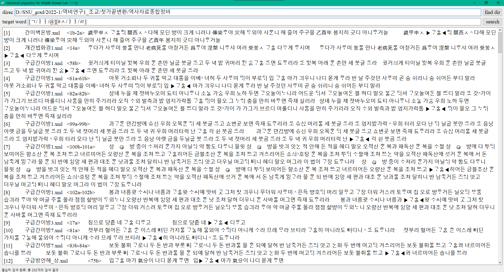

# 역사비교언어학 프로그램 프로젝트 - H-side

|작성자|문의 이메일|라이센스|
|:--:|:---:|:---:|
|강민하|alsgk1123@gmail.com|MIT License|

- 국립국어원에서 제작한 "역사자료 종합 정비물"에서 보다 편리한 검색을 도모하기 위해 제작된 프로그램입니다.

## 1. 업데이트 내역
### 1) 윈도우즈
|업데이트일|버전명|업데이트 내역|
|:-------:|:---:|:----------|
|20220322|ver. 1.1.0.|Initial Commit|
|20220322|ver. 1.0.5.|자소검색 와일드카드 문자(*) 오류 수정|
|20220322|ver. 1.0.4.|에러 핸들링: QMessageBox|
|20220322|ver. 1.0.3.|Pandas 데이터프레임을 기본 딕셔너리로 변환|
|20220322|ver. 1.0.2.|자소검색 기능 추가|
|20220317|ver. 1.0.1.|검색 스트링을 첫가끝으로 변환|
|20220309|ver. 1.0.0.|Initial Setting|

### 2) 맥OS
- 맥OS 실행파일을 만들 수 있도록 도와주신 **김은진 님**(@eunjinkim)께 감사드립니다.

|업데이트일|버전명|업데이트 내역|
|:-------:|:---:|:----------|
|20220323|ver. 1.1.0.|Initial Commit|
|20220323|ver. 1.0.1.|맥OS에 맞도록 코드 수정|

## 2. 사용방법
### 1) 프로그램 다운로드
- 깃허브 레포지토리 우측 상단의 'Code'를 클릭 후 'Download ZIP'을 클릭하면 됩니다.
- 물론 레포지토리를 바로 클론하셔도 무방합니다.

### 2) 구성
다운로드된/클론된 폴더는 다음과 같이 구성되어 있습니다.
- **dict 폴더** : 자소 검색이 가능하도록 도와주는 딕셔너리가 pickle 확장자로 저장되어 있습니다. **해당 폴더와 내용물이 없으면 프로그램이 실행되지 않으므로** 주의해주시기 바랍니다.
- **H-side.exe** 또는 **H-side UNIX 실행파일** : 프로그램의 본체입니다. **dict 폴더와 같은 위치에 있지 않으면 역시 실행되지 않으므로** 주의해주세요. 바탕화면에 두신다면, program_H-side 폴더는 다운받은 위치에 남겨두시고 H-side.exe만 바로가기로 따로 빼서 사용하는 것을 권장드립니다.
- img 폴더 : 이 도움말에 사용된 사진이 들어 있는 폴더입니다.
- icon.ico, icon.png : 프로그램을 장식할 아이콘.
- README.md, README.html : 도움말 파일입니다.
- main.py, searching.py : H-side.exe를 구성하는 Python 스크립트 파일입니다. 삭제하셔도 무방하고, 분석을 위해 남겨두셔도 좋습니다.
- \_\_pycache__ : Python을 실행하면 알아서 생기는 바이트 파일입니다.
- LICENSE : 라이센스 파일입니다. 해당 프로그램은 **MIT LICENSE**를 준수합니다.

### 3) 실행
#### 가. 윈도우즈
- 클론된 폴더/다운로드해서 압축을 해제한 폴더에서 **H-side.exe**를 더블클릭합니다.

#### 나. 맥OS
- 클론된 폴더/다운로드해서 압축을 해제한 폴더에서 **H-side UNIX 실행파일**을 더블클릭합니다.
- 단, 실행하기 전에 **압축을 해제한 폴더를 최상단에** 올리고, **폴더명을 H-side로** 바꾸어주세요.

#### 다. 나는 내가 직접 빌드해서 사용하겠다.
- 또는, **직접 빌드**하셔도 됩니다(!!). pyinstaller가 설치되어 있다면, 터미널에서 이 폴더의 경로까지 들어오신 다음 아래의 명령어를 입력해주세요.
```cmd
pyinstaller -F -w --icon=icon.ico --name H-side main.py
```

### 4) 검색
- 먼저, direc을 설정해야 합니다. **find dir**을 클릭하신 다음, 역사자료종합정비물이 존재하는 폴더를 열어줍니다.
  - 이때, 열린 폴더 안에 하위 폴더가 존재하면 안 된다는 점에 유의해 주세요.
  - 검색할 수 있는 역사자료종합정비물은 .xml이든 .txt이든 상관없으나, **이미 자소 분해가 되어 있는 파일들**이어야 합니다. 즉, 첫가끝 방식으로 변환된 파일들이어야 합니다.
  - direc이 비어 있다면, search를 눌러도 경고창이 출력되면서 검색이 되지 않습니다.

- 다음으로, target word 칸을 채워줍니다. target word에는 다음과 같은 형식이 들어갈 수 있습니다.
  - 일반검색: 평범하게 입력하시면 됩니다.
  - 자소검색: 옛한글을 입력할 수 없거나, 특별히 자소 단위로 분해해서 입력하고 싶다면 원하는 음절을 '\[초성/중성/종성\]'으로 둘러싸 주세요. 입력 방식은 유니콩크와 완전하게 동일합니다.
  - 어떤 검색어를 입력하느냐에 따라 검색 시간이 오래 걸릴 수도 있으므로 주의해주세요. (예: 한 음절로만 입력, 모든 자소에 와일드카드 문자 입력)

- 완료되었다면, search를 눌러주세요. 검색이 완료되면 몇 개가 검색되었는지 알려주는 창이 뜨고, 검색 개수가 하단의 상태바에 표시됩니다.
  - 검색 결과는 'number - 파일명 - 위치 - 검색된 라인' 순서로 표시됩니다.

- 윈도우즈 예시


- 맥OS 예시


- 검색 결과는 화면에뿐만 아니라 H-side.exe가 존재하는 폴더 안에 **result.txt**라는 이름의 텍스트 파일로도 자동으로 저장이 됩니다.

### 5) 번외: 자소검색 방법
- H-side에서 자소 검색은 검색 위치에 상관없이 가능합니다. 입력 방식은 다음과 같습니다.
  - 합용병서, 각자병서, 연서는 모두 단순히 자음을 나열해주면 됩니다.
  - 아래아는 'ㅏㅏ'로 입력하면 됩니다.
  - 중성은 모두 분리해서 적을 수 있습니다. 예를 들어, 'ㅟ'는 'ㅜㅣ'로 적을 수 있습니다.
  - 반치음은 '#ㅅ', 여린히읗은 '#ㅎ', 옛이응은 '#ㅇ'으로 입력하면 됩니다.
  - 치두음은 '!ㅅ', 정치음은 'ㅅ!'와 같이 입력하시면 됩니다.
  - 자소검색 도구('[  ]' 기호)안에 옛한글을 넣을 경우 오류가 날 가능성이 높습니다.
- 자소 검색에서 사용할 수 있는 와일드카드 문자는 다음과 같습니다.
  - **\*** : 해당 위치에 나올 수 있는 모든 소리를 찾습니다. 예를 들어, '[ㄱ/ㅏ/*]'와 같이 입력했다면, 초성이 'ㄱ', 중성이 'ㅏ'인 모든 음절을 찾습니다. '가/강/감/...'등이 나온다고 예상할 수 있겠습니다.
  - **@** : 해당 위치가 비어있음을 나타냅니다. 이 문자는 중성에서는 사용할 수 없습니다(중성이 비어 있는 소리는 없으니까요).